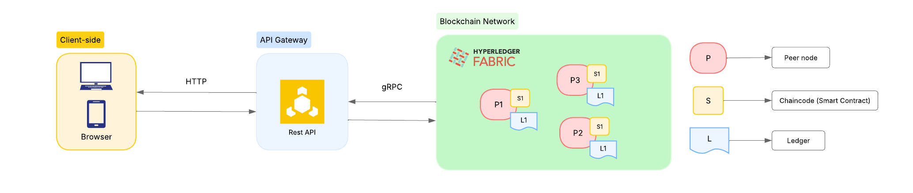

# fabric-telehealth-audit

A Hyperledger Fabric-based prototype for auditability of diagnostic records in emergency telemedicine scenarios.

## Overview

In emergency telemedicine, diagnostic records pass through multiple organizations — emergency medical services, hospitals, and regulatory auditors. Traditional centralized systems rely on trust in a single operator, making it difficult to guarantee that records haven't been altered after the fact.

This prototype uses Hyperledger Fabric to ensure that every diagnostic record is cryptographically signed, immutably stored, and fully traceable across all participating organizations.

## Project Structure

```
fabric-telehealth-audit/
├── network/          # Fabric network setup and scripts
├── chaincode/        # Smart contracts (Go)
└── gateway/          # REST API (Go + Gin + Fabric Gateway SDK)
```

## Architecture


## Prerequisites

- [Docker](https://docs.docker.com/get-docker/)
- [Go](https://go.dev/dl/) 1.23+
- [jq](https://jqlang.github.io/jq/download/)

## Getting Started

### 1. Start the Fabric network

```bash
./network/friendly-microfab-setup.sh
source network/fabric-env.sh
```

### 2. Deploy the chaincode

```bash
chmod +x network/deploy-chaincode.sh
./network/deploy-chaincode.sh
```

### 3. Start the API

```bash
cd gateway
go run cmd/api/main.go
```

## Technology Stack

- **Hyperledger Fabric** — permissioned blockchain platform
- **Microfab** — lightweight Fabric network for local development
- **Go** — chaincode and API
- **Gin** — HTTP router
- **Fabric Gateway SDK** — gRPC-based client for Fabric

## License

This project is part of an academic thesis and is provided as-is for educational purposes.